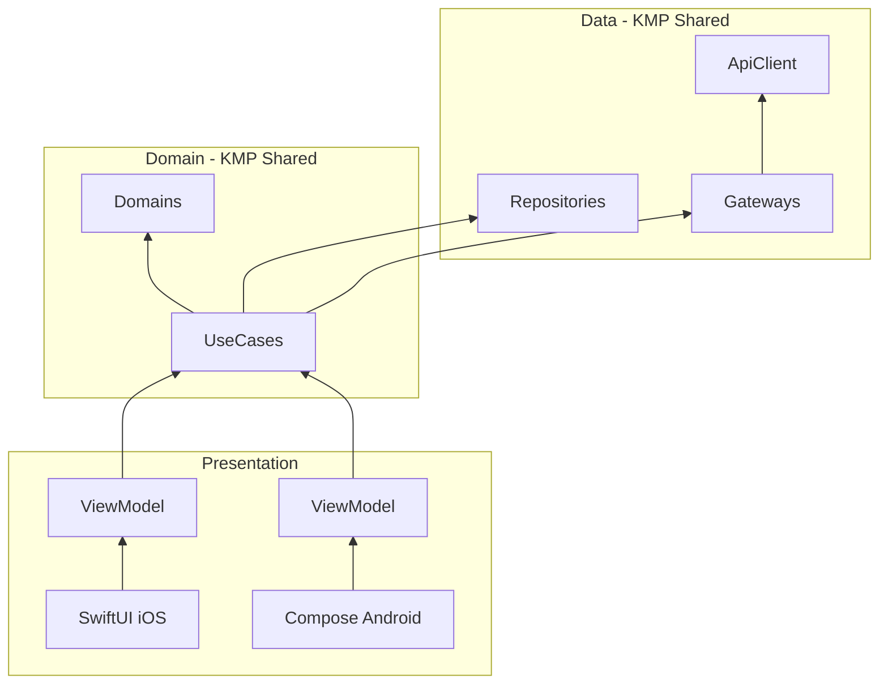
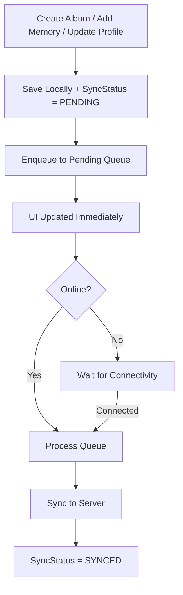

# Memories - Photo Album App

A mobile application where users can log in, manage their profile, and create albums of photo memories. Built with an offline-first architecture and Kotlin Multiplatform (KMP) for shared business logic.

## Platforms

- **iOS**: Swift + SwiftUI
- **Android**: Kotlin + Compose

---

## Setup

### Install

- [Xcode](https://developer.apple.com/xcode/) (iOS development)
- [Android Studio](https://developer.android.com/studio) (Android development + KMP)

### Build

1. Open `frontend` directory in Android Studio
2. Wait for Gradle sync to complete (or run **File > Sync Project with Gradle Files**)

### iOS

```bash
cd frontend

# Build the KMP shared framework
./gradlew :shared:assembleXCFramework

# Open Xcode project
open iosApp/iosApp.xcodeproj
```

### Android

Build and run on emulator or device via Android Studio.

---

## Architecture Overview

### Clean Architecture + MVVM

The app follows **Clean Architecture** with clear separation of concerns:



### Module Structure

**KMP Shared (shared)**

| Package | Responsibility |
|---------|----------------|
| **api** | API client, requests, responses |
| **domain** | Domain models |
| **gateway** | API abstractions |
| **mapper** | DTO ↔ Domain mappers |
| **repository** | Data layer protocols |
| **usecase** | Screen-level application logic, orchestrates Repository/Gateway |

**iOS (iosApp)**

| Module | Responsibility |
|--------|----------------|
| **Domains** | Extensions for KMP domain models (Swift type conversions, Identifiable) |
| **Utilities** | Keychain, formatters |
| **Repositories** | SwiftData + KMP bridge implementations |
| **UseCases** | Swift adapters wrapping KMP use cases |
| **UILogics** | ViewModels, Router protocol |
| **UIComponents** | SwiftUI views |
| **Memories** | DI container, app configuration |

**Android (composeApp)**

| Package | Responsibility |
|---------|----------------|
| **data/repository** | In-memory cache (Token/UserId only persisted) |
| **di** | DI containers (AppContainer, AuthenticatedContainer) |
| **ui/uilogics** | ViewModels |
| **ui/uicomponents** | Compose screens |
| **ui/navigation** | Navigation graph, Routes |


---

## Image Caching Approach

### Display Caching

Images are automatically cached when displayed.

| Platform | Library | Cache |
|----------|---------|-------|
| **iOS** | SDWebImage | Memory + Disk |
| **Android** | Coil | Memory + Disk |

### Offline Image Storage

User-selected images (avatar, album cover, memory photo) are saved to the device's file system. Only the file path is stored in the data model.

```
User selects image
        │
        ▼
Save to FileSystem
        │
        ▼
Store path in model (imageLocalPath)
        │
        ▼
On sync: Upload to server → Delete local file
```

---

## Offline Sync Strategy

All write operations work offline and sync when connectivity is restored.

| Platform | Local Storage |
|----------|---------------|
| **iOS** | SwiftData (persistent) |
| **Android** | In-memory cache |



### Support Sync Queue Operations

| Entity | Create | Update |
|--------|--------|--------|
| **Album** | ✅ | ✅ |
| **Memory** | ✅ | - |
| **User Profile** | - | ✅ |

---

## Deep Linking

### Supported URL Scheme

```
myapp://albums/{albumId}
```


### Testing Deep Links

**iOS**

```bash
xcrun simctl openurl booted "myapp://albums/1"
```

**Android**

```bash
adb shell am start -a android.intent.action.VIEW -d "myapp://albums/1"
```

---

## Automated Tests

### Running Tests

**Shared (Domain / UseCase / Gateway / Mapper)**

Upper layers from UseCase are shared across platforms. Run cross-platform tests with:

```bash
cd frontend
./gradlew :shared:allTests
```

**Platform-specific (UILogic / ViewModel)**

```bash
# Android (Compose)
./gradlew :composeApp:testDebugUnitTest

# iOS (requires simulator)
xcodebuild test -scheme UILogics -destination 'platform=iOS Simulator,name=iPhone 16,OS=26.0'
```

### Test Coverage

| Layer | Tests | Framework |
|-------|-------|-----------|
| **Domain Models** | ✅ | Kotlin Test |
| **Mappers** | ✅ | Kotlin Test |
| **Gateways** | ✅ | Kotlin Test (MockApiClient) |
| **Use Cases** | ✅ | Kotlin Test (Mock repositories) |
| **ViewModels (iOS)** | ✅ | Swift Testing |
| **ViewModels (Android)** | ✅ | JUnit |

---

## Tradeoffs and Future Improvements

### Current Tradeoffs

| Decision | Tradeoff | Rationale |
|----------|----------|-----------|
| **Clean Architecture** | Boilerplate increase | Clear separation of concerns |
| **KMP for business logic** | Learning curve, build complexity | Code sharing, native UI per platform |
| **Optimistic updates** | Potential UI inconsistency | Better perceived performance |

### Future Improvements

1. **Conflict Resolution**
   - Handle server-side changes during offline period
   - Implement last-write-wins or merge strategies

2. **Background Sync**
   - Use iOS Background Tasks for periodic sync
   - Sync when app enters background

3. **E2E Tests**
   - Add UI tests for critical flows (login, deep link)
   - Implement screenshot testing

---

